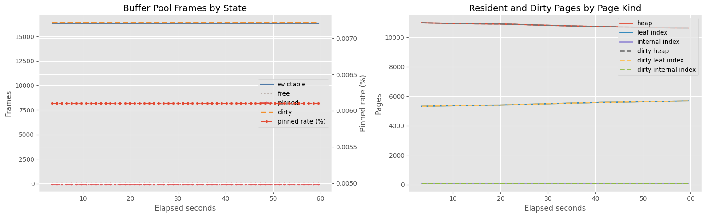
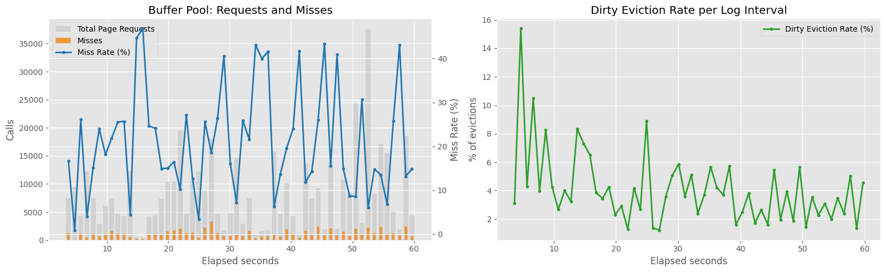
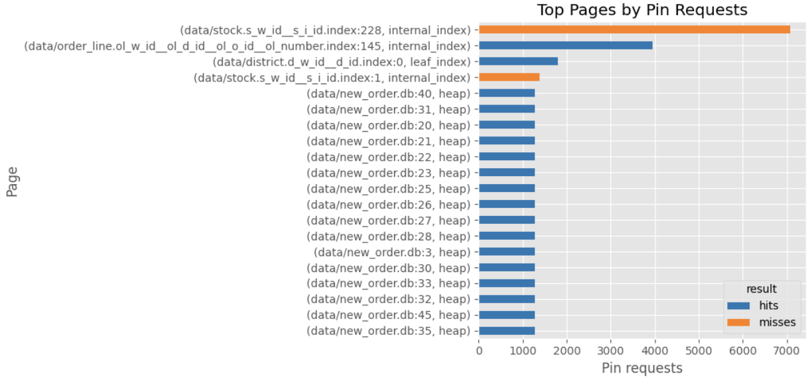
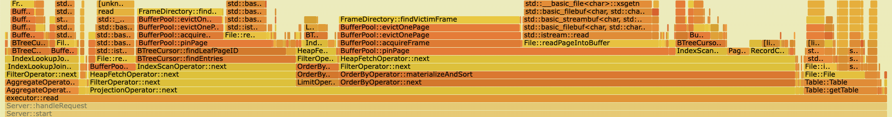
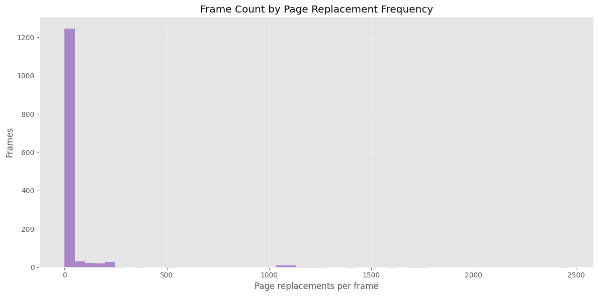
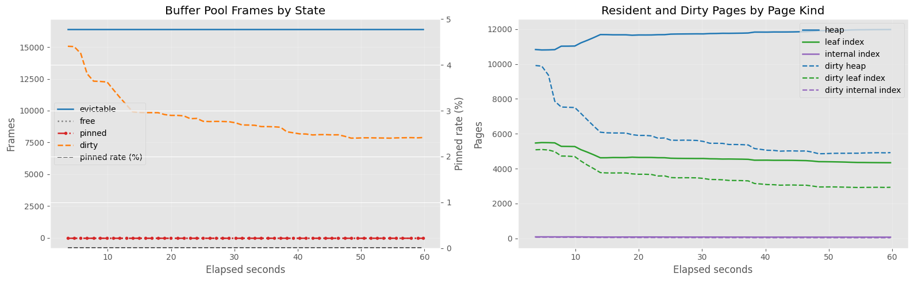
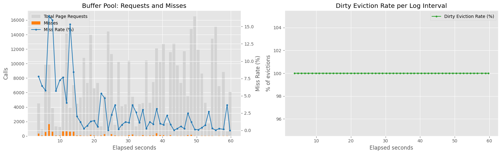
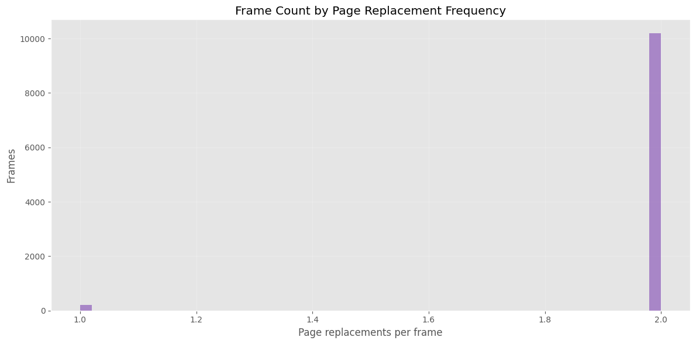
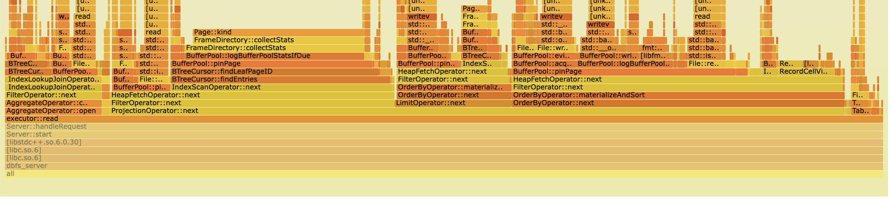
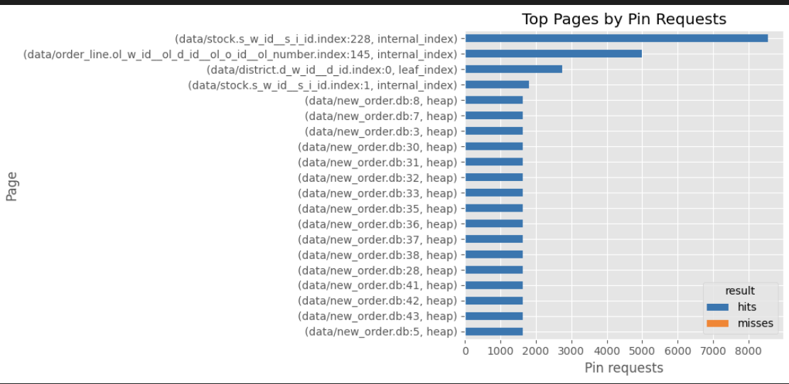

# Analysis

## Frame Analysis

- The number of pinned pages stays at 1. This is expected because the current implementation does not perform concurrent page access.
- The number of internal index pages in the buffer pool is much smaller than the number of other page types. This may be because the total number of internal index pages is small due to the structure of the B-tree.
- Visually, almost all pages in the buffer pool are dirty. This is due to the current replacement policy, which prioritizes replacing pages in clean frames.

## Buffer Pool I/O Analysis

- The miss rate fluctuates significantly. In some intervals, around 45% of page requests miss the buffer pool. This indicates that there are drastic changes in page access locality.
- Dirty write-backs are required only in a limited fraction of evictions, around 7% on average. Since the current implementation prioritizes clean evictable frames, the dirty eviction rate can be interpreted as the frequency with which the buffer pool failed to find a clean replacement candidate.
- In other words, a low dirty eviction rate does not necessarily mean that the buffer pool contains many clean pages. It may instead indicate that the same small set of clean frames is being reused aggressively.

## Page Access Analysis

- The most frequently requested pages are not effectively cached.
- These pages may include root or upper-level internal index pages, but this should be verified with page-type-level statistics. If they are internal index pages, then the current policy is failing to preserve highly reusable pages.

# Current Replacement Policy

The current replacement policy works as follows.

1. If the requested page is not in the buffer pool and there is no free frame, eviction is required.
2. The buffer pool scans frames circularly and searches for an unpinned clean frame.
3. If an unpinned clean frame is found, the requested page is loaded into that frame.
4. If no clean frame is found, the first unpinned dirty frame found during the scan is written back and reused.

This policy is better described as a clean-first circular replacement policy.

# Defining Problem

This policy appears to cause the following problems.

- The most frequently requested pages are not effectively cached. These pages may include root or upper-level internal index pages, but this should be verified with page-type-level statistics.
- Since there is no background cleaning, most buffer pool pages can become dirty. In that state, the clean-first scan often fails to find a clean candidate and may inspect many frames before selecting a dirty victim, which may explain why `findVictim` appears prominently in the flamegraph.

    

- A newly loaded page may be the only clean page immediately after replacement. Since the current policy strongly prefers clean frames, the same frame can be repeatedly selected for page replacement. This causes page-in/page-out operations to concentrate on a small number of frames.

    

# Without clean-first bias

The current replacement policy clearly has a locality problem.

We can stop prioritizing clean frames and compare the result with the current clean-first circular policy. This will help verify whether the clean-first bias is the main cause of the observed behavior.

## Result

- The dirty frame ratio gradually decreased to around 50%. This is because the replacement policy no longer prioritizes clean frames as replacement targets.

- The dirty eviction rate increased to 100%. This means that every selected victim frame required write-back.
- Since this benchmark runs for a fixed duration, the total number of page requests increased as transaction throughput improved.
- Based on visual inspection, the average miss rate appears to have decreased from around 15% to around 2.5%.

- Replacements are now distributed across almost all frames. This indicates that the policy is replacing pages in a more purely circular manner.
- If `page replacements per frame = 2` includes the initial page load, then most frames were replaced only once after initialization. This suggests that the replacement cursor had not yet completed many full cycles over the buffer pool.

- `findVictim` became much less visible in the flamegraph.
- This is consistent with the logic change: instead of scanning many frames to find a clean candidate, the replacement policy now selects the next victim more directly.

- The most frequently accessed pages are now cached. Since the policy no longer concentrates replacement on the same small set of clean frames, frequently accessed pages can remain in the buffer pool after being loaded.

## Summary

In short, disabling the clean-first bias increased dirty write-backs per eviction, but it removed two larger costs from the previous policy.

First, the buffer pool no longer performs a long scan over the frame list just to find a clean frame. This reduced CPU time spent in victim selection.

Second, the policy no longer evicts a small set of clean frames repeatedly just because they are clean. As a result, frequently accessed pages can remain resident in the buffer pool, instead of being evicted despite their high reuse potential.

Therefore, although each eviction became more likely to require write-back, the overall miss rate decreased significantly. Based on visual inspection, the average miss rate appears to have dropped from around 15% to around 2.5%, and transaction throughput improved from 2.83 to 4.28.

This suggests that, for this workload, preserving locality and reducing victim-search overhead mattered more than avoiding dirty write-back.

Avoiding dirty write-back is important, but making it the primary objective of the replacement policy can destroy locality. This also suggests that replacement and dirty-page cleaning should be treated as separate concerns, as is common in production RDBMSs: the replacement policy should preserve locality, while background cleaning or checkpointing should reduce the cost of dirty evictions.

If clean-first eviction is used, it should be applied only within a cold or eviction-candidate region, not globally across the entire buffer pool. This is similar to the design of CFLRU, which separates the LRU list into a working region and a clean-first region, and applies clean-first eviction only in the latter region [[Park et al., 2006](https://doi.org/10.1145/1176760.1176789)].