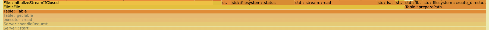
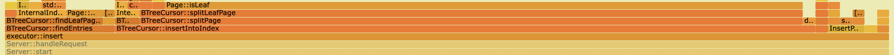
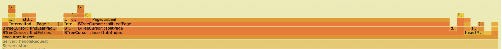

# Flamegraph Review and Cleanup Before Deeper Buffer Pool Design

## Background

The goal of this pass is to review the flamegraph, identify rough
implementation details that pollute the profile, and remove the obvious ones
before doing deeper storage-engine design.

The important distinction is that this is not yet a design pass for async I/O,
background flushing, prefetching, or a new replacement policy. Those may become
necessary later, but they should be based on a profile that is not dominated by
avoidable implementation artifacts. Cleaning up those artifacts should make the
remaining flamegraph easier to interpret and should give a better view of the
actual bottlenecks.

## Review Findings And Cleanup Targets

### Victim Selection

`FrameDirectory::findVictimFrame` looked suspicious because the implementation
did relatively heavy work on every eviction:


```text
scan all 16,384 frames
collect every evictable frame into a vector
construct random_device
construct mt19937
choose one random victim
```

This is expensive for a primitive that can run on the page-acquisition path. A
simpler bounded scan, such as a clock-style scan, should remove candidate-vector
allocation and per-eviction random generator construction.

This item is also where better metrics are needed. The flamegraph shows cost,
but it does not directly separate eviction frequency from eviction cost. Useful
DBFS-side counters would include pin hits, pin misses, evictions, dirty
evictions, page reads, and page writes.

### Redundant Frame Zeroing

`BufferPool::zeroOutFrame` appeared under page acquisition. Zeroing is needed
for newly-created pages, but it should be wasted work before a full
`readPageIntoBuffer`, because the disk read should overwrite the whole frame.

The cleanup target is to skip frame zeroing for full page reads while keeping it
for newly-created pages.

### Foreground Page Writeback

`File::writePageFromBuffer` was also visible in the eviction path. This can mean
dirty victims are being written synchronously while foreground execution waits.

This pass does not attempt a background writer or a full replacement-policy
redesign. The smaller cleanup target is to check whether preferring clean
victims helps, as long as the clean-victim search itself remains bounded and
does not become more expensive than the writeback it is trying to avoid.

### Table Path Preparation

`std::filesystem::create_directories` appeared under this measured execute-phase
stack:



```text
Server::handleRequest
executor::read
Table::getTable
Table::Table
Table::preparePath
std::filesystem::create_directories
std::filesystem::status
fstatat64
```

This was not BenchBase prepare/load work leaking into the measurement. The
benchmark script runs create/load before starting perf, then records only the
execute phase. The path appeared because query execution calls
`Table::getTable`, and table construction used to call `preparePath` for heap
and index files. `preparePath` checked/created the parent directory every time,
which showed up as filesystem status checks.

The cleanup target is to keep `data/` creation outside `Table` construction.
Server startup already creates `data/`, and if the directory is missing later,
the subsequent file open/create path should fail loudly instead of silently
repairing the environment.

### Leaf Split Sibling Rewire

`BTreeCursor::splitLeafPage` looked suspicious because almost all samples under
it landed in `Page::isLeaf`:





```text
BTreeCursor::insertIntoIndex
BTreeCursor::splitPage
BTreeCursor::splitLeafPage
Page::isLeaf
```

`Page::isLeaf` itself is not expensive. It was where the samples landed inside
`rewireLeafSiblingPredecessor`, which did a full index-file scan on every leaf
split:

```text
for every page id from 0 to index_file.getMaxPageID()
  pin page
  check page->isLeaf()
  if leaf.right_sibling == old_page_id, rewrite it to new_page_id
```

The root cause was the split direction: the new leaf was inserted to the left
of the old leaf, so the code had to find whichever existing leaf used to point
at the old leaf. The cleanup target is to keep the old leaf on the left and
link the new leaf to the right:

```text
new.right = old.right
old.right = new
```

That makes leaf split sibling maintenance local to the two pages being split,
instead of proportional to the total number of pages in the index file.

## Results

I compared the DBFS artifacts from the following TPCC runs:

```text
before:      benchmarking/results/20260607-095352_current-rerun
after try 1: benchmarking/results/20260608-091700
after try 2: benchmarking/results/20260608-100445
```

All runs were `scalefactor=1`, `terminals=1`, and measured the 60 second execute
phase.

### End-To-End Result

| Metric | Before | After try 1 | Change | After try 2 | Change |
| --- | ---: | ---: | ---: | ---: | ---: |
| Measured requests | 244 | 349 | +43.0% | 356 | +45.9% |
| Throughput | 4.07 req/s | 5.82 req/s | +43.0% | 5.93 req/s | +45.9% |
| Goodput | 4.05 req/s | 5.80 req/s | +43.2% | 5.93 req/s | +46.5% |
| Average latency | 243.8 ms | 171.7 ms | -29.6% | 168.3 ms | -31.0% |
| Median latency | 131.7 ms | 108.9 ms | -17.3% | 102.5 ms | -22.2% |
| P95 latency | 709.9 ms | 446.1 ms | -37.2% | 464.4 ms | -34.6% |
| P99 latency | 956.6 ms | 583.1 ms | -39.0% | 626.4 ms | -34.5% |
| Max latency | 1137.6 ms | 921.4 ms | -19.0% | 1177.2 ms | +3.5% |

This should be read as an end-to-end before/after result for these runs, not
as proof that the removed hot paths alone caused the full response-level
improvement. The directly removed stack weight was much smaller than the
throughput delta: `create_directories` was 1.13%, `splitLeafPage` was 4.71%, and
`zeroOutFrame` was 0.17% in the before profile. Even if those direct costs were
removed perfectly, that only explains a small part of a +43-46% throughput
change.
The rest may come from indirect effects, benchmark variance, logging/config
differences, or workload-state differences between execute phases. More
repeat runs or smaller ablation runs are needed before attributing the whole
delta to these changes.

### Result By Finding

| Finding / cleanup target | Before | After try 1 | After try 2 | Result |
| --- | ---: | ---: | ---: | --- |
| `FrameDirectory::findVictimFrame` | 29.38% | 42.98% | 44.74% | Not improved. It remains the largest unresolved buffer-pool signal. |
| `BufferPool::zeroOutFrame` | 0.17% | 0.00% | 0.00% | Confirmed, but the direct win is small. |
| `File::writePageFromBuffer` | 2.27% | 0.25% | 0.93% | Improved in the profile, but this does not prove fewer dirty evictions without DBFS-side eviction counters. |
| `File::readPageIntoBuffer` | 17.44% | 8.82% | 9.23% | Improved in the profile, likely helped by fewer wasted index/page accesses. |
| DBFS buffer-pool counters | not exported | not exported | not exported | Not confirmed. The result artifacts only include BenchBase/PostgreSQL-style metrics, so eviction frequency and dirty-eviction counts are still inferred from perf. |
| `std::filesystem::create_directories` from table construction | 1.13% | 0.00% | 0.00% | Confirmed. The measured execute path no longer performs directory creation/status checks from `Table` construction. |
| `BTreeCursor::splitLeafPage` | 4.71% | 0.00% | 0.12% | Mostly confirmed. Some split work remains, but the old full-scan symptom is gone. |
| `BTreeCursor::splitLeafPage;Page::isLeaf` | 4.53% | 0.00% | 0.00% | Confirmed. The predecessor full-scan path disappeared from the profile. |

The query trace also improved on the hottest repeated statements:

| Query shape | Before mean | After try 1 | Change | After try 2 | Change |
| --- | ---: | ---: | ---: | ---: | ---: |
| `UPDATE stock ... WHERE S_I_ID = ? AND S_W_ID = ?` | 13.8 ms | 10.8 ms | -21.7% | 10.7 ms | -22.9% |
| `SELECT ... FROM item WHERE I_ID = ?` | 10.5 ms | 6.7 ms | -35.8% | 6.5 ms | -38.3% |
| `SELECT ... FROM stock ... FOR UPDATE` | 10.1 ms | 6.5 ms | -35.8% | 6.8 ms | -32.2% |

## Interpretation

This pass achieved the cleanup goal for the obvious artifacts:

- `std::filesystem::create_directories` disappeared from measured execution
- redundant `zeroOutFrame` disappeared from the read path
- leaf split no longer performs a full index-file scan to rewire siblings

That makes the profile cleaner, but it does not mean the buffer pool problem is
solved. The original `findVictimFrame` concern was not confirmed as fixed, and
victim selection / eviction frequency remains the main unresolved buffer-pool
topic.

The next useful step is to add DBFS-side buffer-pool counters and run repeat or
ablation benchmarks. Without those, perf can show where samples landed, but it
cannot clearly answer whether the remaining cost is caused by too many
evictions, expensive victim selection, dirty writeback, or the page access
pattern itself.
